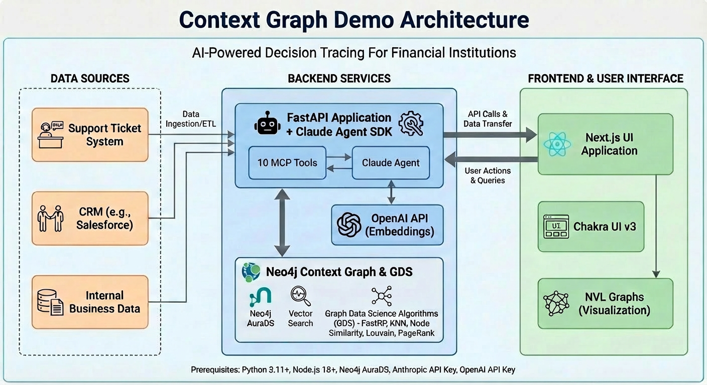

# Context Graph Demo

A demonstration project showing how to build and use **Context Graphs** with Neo4j for AI-powered decision tracing in financial institutions.



## What is a Context Graph?

Context Graphs are the infrastructure layer that enables AI agents to make enterprise-grade decisions. They capture **decision traces** - the tribal knowledge, exception logic, and reasoning that traditionally lives only in human experts' heads.

Key concepts:
- **State Clock**: What is true now (traditional databases)
- **Event Clock**: What happened, when, and why (context graphs)
- **Decision Traces**: Full reasoning, risk factors, confidence scores, and causal relationships


## AI-powered Decision Tracing For Financial Institutions


### AI Assistant

Ask questions about customers, decisions, and policies.


### Context Graph

Visualize entities, decisions, and causal relationships.


### Decision Trace

Inspect reasoning, precedents, and causal chains.


## Demo Scenarios


### Scenario 1: Credit Decision with Precedent Lookup

```
User: "Should we approve a $50K credit line increase for John Smith?"

Agent:
1. Searches customer profile
2. Finds similar past decisions via FastRP embeddings
3. Cites relevant precedents
4. Makes recommendation with confidence score
5. Records decision trace with full reasoning
```

### Scenario 2: Fraud Pattern Detection

```
User: "Analyze account #12345 for fraud patterns"

Agent:
1. Uses FastRP embeddings to compare with known fraud typologies
2. Applies Node Similarity to find structural matches
3. Visualizes suspicious patterns in graph
4. Returns risk score with explanation
```

### Scenario 3: Exception Request with Audit Trail

```
User: "We need to override the trading limit for XYZ Corp"

Agent:
1. Finds past exceptions and their outcomes
2. Traces causal chain of similar exceptions
3. Records exception with justification and precedent links
4. Links to applicable policies
```

## Key Features


This demo showcases three key differentiators of Neo4j for context graphs:

### 1. Data Model Fit
Neo4j is the natural substrate for context graphs - entities, decisions, and causal relationships map directly to nodes and relationships.

### 2. Graph Data Science Algorithms
Graph Data Science algorithms provide **structural/topological similarity** that's impossible on Postgres without a PhD in graph theory:
- **FastRP**: 75,000x faster than node2vec, captures structural embeddings
- **KNN**: Find k-nearest neighbors based on graph structure
- **Node Similarity**: Compare neighborhood patterns (fraud detection)
- **Louvain**: Community detection for decision clusters
- **PageRank**: Influence scoring for decision impact

### 3. Vector Embeddings + Graph
Combine semantic similarity (text embeddings) with structural similarity (FastRP) for hybrid search that understands both meaning and context.

## Architecture

```
┌─────────────────┐     ┌─────────────────┐     ┌─────────────────┐
│   Next.js UI    │────▶│  FastAPI + SDK  │────▶│  Neo4j + GDS    │
│  Chakra UI v3   │     │  Claude Agent   │     │  Vector Search  │
│  NVL Graphs     │     │  10 MCP Tools   │     │  FastRP/KNN     │
└─────────────────┘     └─────────────────┘     └─────────────────┘
```

## Prerequisites

- Python 3.11+ with [uv](https://docs.astral.sh/uv/) package manager
- Node.js 18+
- Neo4j AuraDS instance (or local Neo4j Enterprise with GDS plugin)
- Anthropic API Key
- OpenAI API Key (for embeddings)

## Quick Start

### 1. Clone and Setup Environment

```bash
cd context-graph

# Create environment file
cat > .env << 'EOF'
# Neo4j Connection
NEO4J_URI=neo4j+s://xxxx.databases.neo4j.io
NEO4J_USERNAME=neo4j
NEO4J_PASSWORD=your_neo4j_password

# Anthropic API Key (for Claude Agent SDK)
ANTHROPIC_API_KEY=your_anthropic_key

# OpenAI API Key (for text embeddings)
OPENAI_API_KEY=your_openai_key
EOF
```

### 2. Install Backend Dependencies

```bash
cd backend

# Create virtual environment and install dependencies with uv
uv venv
uv pip install -e .
```

### 3. Generate Sample Data

```bash
cd backend
source .venv/bin/activate
export $(grep -v '^#' ../.env | xargs)
python scripts/generate_sample_data.py
```

This creates:
- 200 persons
- 350 accounts  
- 2000 transactions
- 600 decisions with causal chains
- 50 organizations
- 30 employees
- 15 policies

### 4. Start Backend

```bash
cd backend
source .venv/bin/activate
export $(grep -v '^#' ../.env | xargs)
uvicorn app.main:app --port 8000
```

Backend runs at http://localhost:8000

### 5. Start Frontend

```bash
cd frontend
npm install
npm run dev
```

Frontend runs at http://localhost:3000

## Using Neo4j AuraDS (Recommended)

For the best experience with GDS algorithms:

1. Create an AuraDS instance at https://console.neo4j.io
2. Note the connection URI (format: `neo4j+s://xxxx.databases.neo4j.io`)
3. Update your `.env` with the connection details

AuraDS includes all GDS algorithms (FastRP, KNN, Node Similarity, Louvain, PageRank) without additional configuration.

## Using Local Neo4j with Docker

If you have a Neo4j Enterprise license:

```bash
docker-compose up -d
```

Wait for Neo4j to be ready at http://localhost:7474, then update `.env`:

```bash
NEO4J_URI=bolt://localhost:7687
NEO4J_USERNAME=neo4j
NEO4J_PASSWORD=password
```


## API Endpoints

| Endpoint | Description |
|----------|-------------|
| `GET /health` | Health check |
| `POST /api/chat` | Chat with AI agent |
| `POST /api/chat/stream` | Streaming chat with SSE |
| `GET /api/customers/search?query=` | Search customers |
| `GET /api/customers/{id}` | Get customer details |
| `GET /api/customers/{id}/decisions` | Get customer decisions |
| `GET /api/decisions` | List decisions |
| `GET /api/decisions/{id}` | Get decision details |
| `POST /api/decisions` | Create new decision |
| `GET /api/decisions/{id}/similar` | Find similar decisions |
| `GET /api/decisions/{id}/causal-chain` | Get causal chain |
| `GET /api/graph` | Get graph visualization data |
| `GET /api/graph/expand/{node_id}` | Expand node connections |
| `POST /api/graph/relationships` | Get relationships between nodes |
| `GET /api/graph/schema` | Get graph schema |
| `GET /api/graph/statistics` | Get graph statistics |
| `GET /api/policies` | List policies |
| `GET /api/policies/{id}` | Get policy details |

## Project Structure

```
context-graph/
├── backend/
│   ├── app/
│   │   ├── main.py              # FastAPI application
│   │   ├── agent.py             # Claude Agent SDK with MCP tools
│   │   ├── context_graph_client.py  # Neo4j operations
│   │   ├── gds_client.py        # GDS algorithms
│   │   ├── vector_client.py     # Vector search
│   │   └── models/              # Pydantic models
│   └── scripts/
│       └── generate_sample_data.py
├── frontend/
│   ├── app/                     # Next.js pages
│   ├── components/
│   │   ├── ChatInterface.tsx    # AI chat with inline graphs
│   │   ├── ContextGraphView.tsx # NVL visualization
│   │   └── DecisionTracePanel.tsx
│   └── lib/
│       └── api.ts               # API client
├── cypher/
│   ├── schema.cypher            # Neo4j schema
│   └── gds_projections.cypher   # GDS algorithms
├── docker-compose.yml           # Local Neo4j setup
└── .env                         # Environment variables
```

## Agent Tools (MCP)

The Claude Agent has access to 10 custom tools:

| Tool | Description |
|------|-------------|
| `search_customer` | Search customers by name, email, account number |
| `get_customer_decisions` | Get all decisions about a customer |
| `find_similar_decisions` | FastRP-based structural similarity search |
| `find_precedents` | Semantic + structural precedent search |
| `get_causal_chain` | Trace causes and effects of a decision |
| `record_decision` | Create new decision trace with reasoning |
| `detect_fraud_patterns` | Graph-based fraud analysis |
| `get_policy` | Get current policy rules |
| `execute_cypher` | Read-only Cypher for custom analysis |
| `get_schema` | Retrieve the current Neo4j schema |

## Neo4j Data Model

### Core Entities
- `Person` - Customer/employee with FastRP embedding
- `Account` - Bank/trading accounts with risk tiers
- `Transaction` - Financial transactions with fraud scores
- `Organization` - Companies with sanctions status

### Decision Trace Nodes
- `Decision` - Core decision with reasoning, confidence
- `DecisionContext` - State snapshot at decision time
- `Precedent` - Links to similar past decisions
- `Policy` - Rules governing decisions
- `Exception` - Documented exceptions

### Key Relationships
```
(:Decision)-[:CAUSED]->(:Decision)
(:Decision)-[:INFLUENCED]->(:Decision)
(:Decision)-[:PRECEDENT_FOR]->(:Decision)
(:Decision)-[:ABOUT]->(:Person|:Account|:Transaction)
(:Decision)-[:APPLIED_POLICY]->(:Policy)
(:Decision)-[:GRANTED_EXCEPTION]->(:Exception)
```

## GDS Algorithms

### FastRP Embeddings
```cypher
CALL gds.fastRP.mutate('decision-graph', {
  embeddingDimension: 128,
  iterationWeights: [0.0, 1.0, 1.0, 0.8, 0.6],
  mutateProperty: 'fastrp_embedding'
})
```

### Hybrid Search (Semantic + Structural)
```cypher
// Find decisions similar in both meaning and graph structure
CALL db.index.vector.queryNodes('decision_semantic_idx', 10, $query_embedding)
YIELD node, score AS semantic_score
WITH node, semantic_score
CALL db.index.vector.queryNodes('decision_fastrp_idx', 10, node.fastrp_embedding)
YIELD node AS similar, score AS structural_score
RETURN similar, (semantic_score + structural_score) / 2 AS combined_score
ORDER BY combined_score DESC
```



```mermaid
%%{init: {'theme': 'base', 'themeVariables': { 'primaryColor': '#0C1A35', 'primaryTextColor': '#fff', 'primaryBorderColor': '#0C1A35', 'lineColor': '#5A6A85', 'secondaryColor': '#E5ECF6', 'tertiaryColor': '#fff'}}}%%
graph LR
    subgraph Sources ["Data Sources - System of Record"]
        direction TB
        CRM[CRM]
        Tickets[Support Ticket System]
        InternalDB[Internal Business Data]
    end
    subgraph Ingestion ["Data Pipeline"]
        ETL["Data Ingestion & Graph Mapping"]
    end
    subgraph DataLayer ["Neo4j Context Graph Platform"]
        direction TB
        subgraph GraphDB ["Neo4j Graph Database"]
            Nodes["Nodes & Relationships<br/>Person, Account, Decision, Policy"]
        end
        
        subgraph GDS ["Graph Data Science - GDS"]
            Algo1["FastRP Embeddings<br/>Structural Similarity"]
            Algo2["KNN / Node Similarity<br/>Pattern Detection"]
        end
        subgraph VectorStore ["Vector Search"]
            Embeddings["Semantic Embeddings<br/>Unstructured Text"]
        end
    end
    subgraph Backend ["Backend Services - Python"]
        direction TB
        FastAPI[FastAPI Server]
        
        subgraph AI ["AI Logic Layer"]
            ClaudeSDK[Claude Agent SDK]
            MCP["10 MCP Tools<br/>Model Context Protocol"]
        end
    end
    subgraph ExternalAPIs ["External AI Services"]
        direction TB
        OpenAI["OpenAI API<br/>Embedding Generation"]
        Anthropic["Anthropic API<br/>LLM Reasoning"]
    end
    subgraph Frontend ["Frontend Application - Next.js"]
        direction TB
        UIChat["AI Assistant UI<br/>Chakra UI"]
        UIGraph["Context Graph Visualizer<br/>NVL Graphs"]
        UITrace[Decision Trace Inspector]
    end
    
    Sources --> ETL
    ETL --"Structured Data"--> Nodes
    ETL --"Text for Embedding"--> OpenAI
    OpenAI --"Vector Embeddings"--> VectorStore
    
    Nodes -.-> GDS
    GDS -.-> Nodes
    
    FastAPI <--> ClaudeSDK
    ClaudeSDK --"Uses"--> MCP
    MCP --"Hybrid Search"--> DataLayer
    ClaudeSDK --"Prompt & Context"--> Anthropic
    Anthropic --"Decision & Reasoning"--> ClaudeSDK
    MCP --"Records Decision Trace"--> Nodes
    
    Frontend <--> FastAPI
    
    classDef source fill:#E5ECF6,stroke:#5A6A85,color:#0C1A35
    classDef ingestion fill:#E5ECF6,stroke:#5A6A85,color:#0C1A35,stroke-dasharray: 5 5
    classDef neodb fill:#0C1A35,stroke:#0C1A35,color:#fff
    classDef backend fill:#2D4572,stroke:#0C1A35,color:#fff
    classDef external fill:#E5ECF6,stroke:#5A6A85,color:#0C1A35
    classDef frontend fill:#6C757D,stroke:#0C1A35,color:#fff
    
    class CRM,Tickets,InternalDB source
    class ETL ingestion
    class GraphDB,GDS,VectorStore neodb
    class FastAPI,AI backend
    class OpenAI,Anthropic external
    class Frontend frontend
```

## References

- [AI's Trillion-Dollar Opportunity: Context Graphs](https://foundationcapital.com/context-graphs-ais-trillion-dollar-opportunity/) - Foundation Capital
- [Claude Agent SDK](https://github.com/anthropics/claude-agent-sdk-python)
- [NVL Visualization Library](https://neo4j.com/docs/nvl/)

## License

MIT
